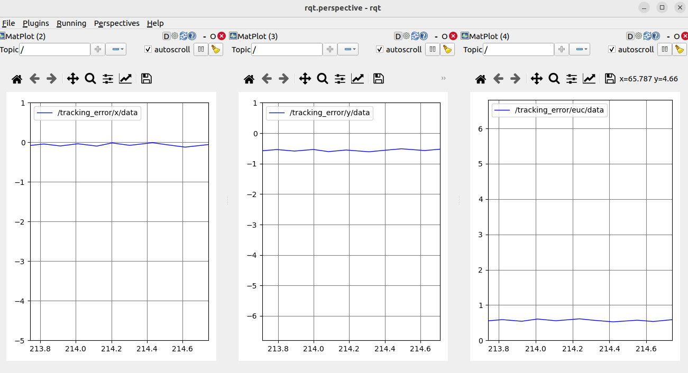

# control_lecture

## Homework Assignment

For this homework assignment, you'll be implementing crucial functions within both the Pure Pursuit and Stanley Controllers. Below are the tasks for each controller:

### Pure Pursuit Controller

**Task:** Implement the `generate_control_output` function to calculate the steering angle required for path following.

**Instructions:**
- Utilize the waypoints stored in `self.waypoints` to determine the optimal steering angle for the vehicle to follow the predefined path.
- Ensure that you incorporate the `self.wheelbase` parameter in your calculations to accurately determine the vehicle's turning radius.

### Stanley Controller

**Task:** Implement the `generate_control_output` function to calculate the steering angle required for path following.

**Instructions:**
- Utilize the waypoints stored in `self.waypoints` to calculate the desired heading and cross-track error.

## Modifying Code Sections

### Pure Pursuit Controller (/src/controller/controller/pure_pursuit.py)
Students should only modify the following sections of the code in the provided `pure_pursuit.py` file:

- Implement the `generate_control_output(self, current_x, current_y, yaw)` function.
- Tune the parameters:
    - `self.k` (proportional gain)
    - `self.linear_velocity` (constant linear velocity)
    - `self.lookahead_distance` (lookahead distance)

### Stanley Controller (/src/controller/controller/stanley.py)
Students should only modify the following sections of the code in the provided `stanley.py` file:

- Implement the `generate_control_output(self, current_x, current_y, yaw)` function.
- Tune the parameters:
    - `self.k` (proportional gain)
    - `self.linear_velocity` (constant linear velocity)
  
<b> Ensure that you do not modify other sections of the code to maintain compatibility with the existing system. Additionally, note that we will use our own code for testing, and only your controller code will be utilized, excluding the rest. <b/>

## Testing and Evaluation

- Test your implementations in a simulated environment using ROS 2 and Gazebo.
- Explore parameter tuning to observe the behavior of the vehicle under different scenarios.

By completing this assignment, you'll reinforce your understanding of control strategies for autonomous vehicle navigation and gain practical experience in developing control algorithms for autonomous systems.

## Additional Notes:

- The provided code includes a pre-built racing track in the Gazebo simulation environment. Your task is to write Pure Pursuit and Stanley controllers to control the vehicle on this track.
- You are only required to write the Pure Pursuit and Stanley controllers. The remaining code is provided by the course staff.
- Test your code thoroughly and tune the necessary parameters (e.g., lookahead distance, k) to ensure optimal performance.
- Upon submission, your code will be tested. Your controllers should complete the track under 8 minutes without any crashes.


## Dependencies

You need to install ROS 2 Humble and Gazebo Sim for this project.

- [ROS2 Humble installation instructions](https://docs.ros.org/en/humble/Installation/Ubuntu-Install-Debians.html)
- [Gazebo Sim installation instructions](https://gazebosim.org/docs/fortress/install_ubuntu)

ROS2 Package dependencies
```bash
sudo apt install ros-humble-ros-gz-sim ros-humble-ros-gz-bridge ros-humble-xacro ros-humble-joint-state-publisher* ros-humble-rqt*
```
## Clone the repo

```bash
git clone --recurse-submodules https://github.com/ITU-EMAV/control-project-<your_username>
```

## Building the packages

Build the package and source install/setup.bash.
```bash
colcon build --packages-select gazebo_project controller messages --symlink-install && source install/setup.bash
```

- To run the gazebo simulation and rviz:
```bash
ros2 launch launch/gazebo_launch.py

```
### Launching the gazebo_launch.py script will open two windows: RViz and the Gazebo simulation environment (The initial loading time for the first run may take up to 10 minutes as it downloads the map.)
&nbsp;
### To position the camera near the vehicle, click the "Move To" button:
&nbsp;
### For illumination, use the provided button to light up the surroundings:
&nbsp;
<br/>
&nbsp;


- To execute the Pure Pursuit and Stanley controllers, you'll need to implement them first. Once implemented, use the following commands. Ensure that you've launched the gazebo_launch.py script beforehand. The gazebo.launch.py script should be running simultaneously with the Pure Pursuit or Stanley controller.
Also, remember to source the environment with ```source install/setup.bash``` before running the controllers.
- Pure Pursuit
```bash
ros2 run controller pure_pursuit
```
- Stanley:
```bash
ros2 run controller stanley
```
### After running the controller, you can observe the reference tracking errors on the x-axis, y-axis, and as Euclidean distance.
&nbsp;
<br/>

## How to submit?
- Simply push the changes you made to your cloned repository at: https://github.com/ITU-EMAV/control-project-<your_username>
